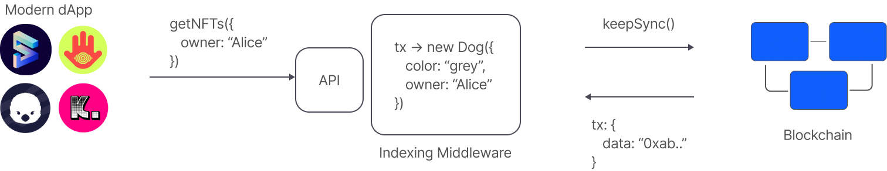
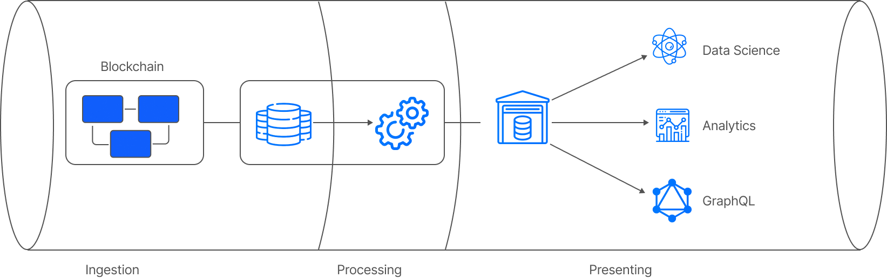
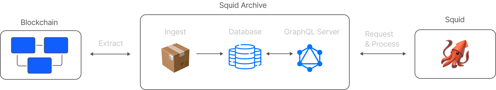
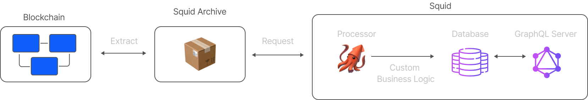

<!-- _backgroundImage: url(./bg.png) -->
<span class=title>

## Blockchain indexing by example

</span>

<span class=subtitle>

### Process transfers of $REEF

</span>

### 
### 
### 
### 

---

# Greetings 👋

### Massimo Luraschi

### Developer Advocate @ subsquid.io

*  [@RaekwonIII](https://twitter.com/RaekwonIII) 
*  RaekwonIII#3962 
*  [@RaekwonTheChefIII](https://t.me/RaekwonTheChefIII) 
*  [RaekwonIII](https://github.com/RaekwonIII) 

---



<span class=bulletpoint>

##### Ingest on-chain data
##### Data processing framework

</span>

---

<span class=subtitle>

### Modular Architecture

</span>



---

<span class=subtitle>

### Monolith

</span>

**Multiple uses, same ingestion**
**Potential replication**
**Wasted effort, resources**

<span class=subtitle>

### Modular

</span>

**Shared extraction services: Archives**

---
<span class=subtitle>

### Data flow

</span>



---
<span class=subtitle>

### Archives benefits

</span>

###### One less thing to **care about**
###### Better storage, **better performance**
###### **Filtering** batching
###### Reduced **network overhead**
###### Modularity ➡️ **future improvements**

---

<span class=subtitle>

### squids 🦑

</span>



---
<span class=subtitle>

### Subsquid SDK benefits

</span>

###### **Automated** model generation
###### Automated **ABI ➡️ code**
###### **Code** (TypeScript), not config
###### Strong typigns/**type safety**
###### **Aquarium** - hosted service

---

<!-- _color: #105EFB -->
<span class="subtitle">

### From schema...
</span>

```graphql
type Owner @entity {
  id: ID!
  ownedTokens: [Token!]! @derivedFrom(field: "owner")
  balance: BigInt
}
```

---
<!-- _color: #105EFB -->

<span class="subtitle">

####
#### ...To Models
</span>

```typescript
@Entity_()
export class Owner {
  constructor(props?: Partial<Owner>) {
    Object.assign(this, props)
  }

  @PrimaryColumn_()
  id!: string

  @OneToMany_(() => Token, e => e.owner)
  ownedTokens!: Token[]

  @Column_("numeric", {transformer: marshal.bigintTransformer, nullable: true})
  balance!: bigint | undefined | null
}

```

---
<!-- _color: #105EFB -->

<span class="subtitle">

### From ABI...
</span>

```json
[
  // ...
  {
    "inputs": [
      { "internalType": "address", "name": "to", "type": "address" },
      { "internalType": "uint256", "name": "tokenId", "type": "uint256" }
    ],
    "name": "approve",
    "outputs": [],
    "stateMutability": "nonpayable",
    "type": "function"
  },
  // ...
]
```

---
<!-- _color: #105EFB -->

<span class="subtitle">

### …to TypeScript
</span>

```typescript
export const functions = {
    // ...
    approve: new Func<[to: string, tokenId: ethers.BigNumber], {to: string, tokenId: ethers.BigNumber}, []>(
        abi, '0x095ea7b3'
    ),
    // ...
}

const { _name } = functions.approve.decode(transaction.input);
```

---
<!-- _color: #105EFB -->

<span class="subtitle">

### Aquarium hosting service
</span>

```bash
npm i -g @subsquid/cli@latest
sqd deploy .
```

Visit [app.subsquid.io](https://app.subsquid.io/)

---
<!-- _color: #105EFB -->

<span class="subtitle">

### Resources
</span>

Docs [docs.subsquid.io](https://docs.subsquid.io)
GitHub [github.com/subsquid/](https://github.com/subsquid/)
YouTube [youtube.com/c/subsquid](https://www.youtube.com/channel/@subsquid)
Discord [discord.gg/subsquid](https://discord.gg/subsquid)
Telegram [t.me/HydraDevs](https://t.me/HydraDevs)
Medium [medium.com/subsquid](https://medium.com/subsquid)

